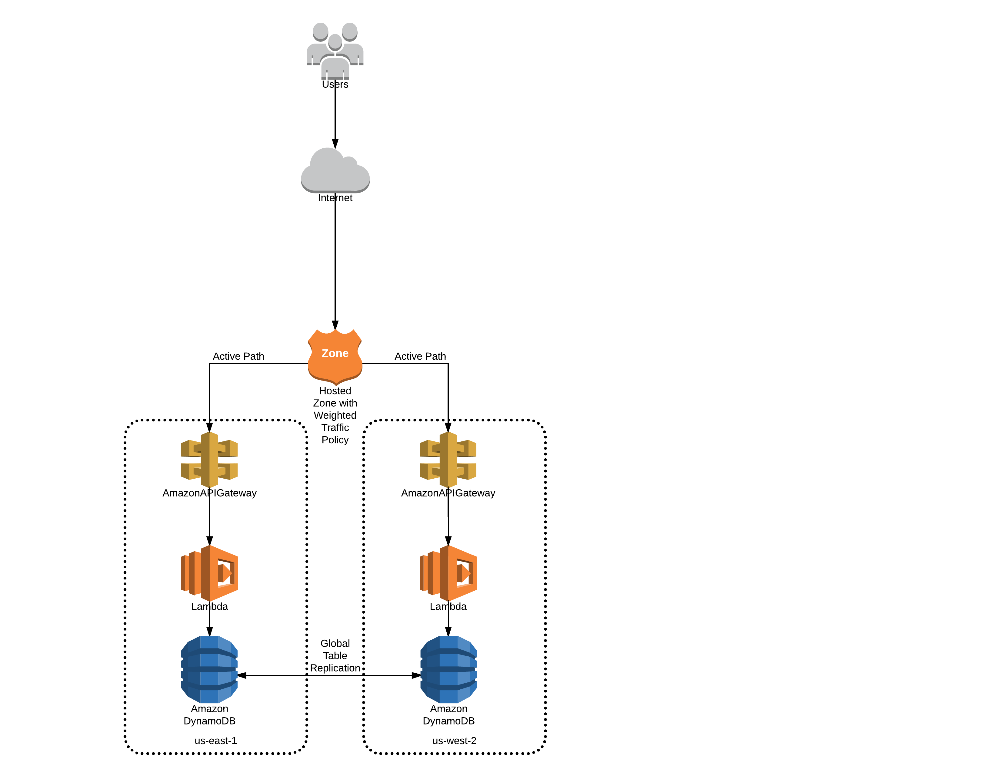

# Two Region AWS Serverless Deployment

This project illustrates how to install a serverless application in two AWS regions,
and set up a Route 53 weighted routing policy using a common custom domain name
for both regions, with a global dynamodb replication group. 

This leverages the ability to denote API gateway deployments
as Regional; prior to that a Cloud Front distribution with an API gateway origin
has to be used, and failover performed as a manual route away by updating the 
Cloud Front origin.

With a weighted routing policy, traffic is distributed to the two sites based on the weights assigned. For this reference architecture, traffic is routed uniformly between the two sites. With a weighted policy, should one site's Route 53 health check indicate an unhealthy state, all traffic would be routed to the remaining site.

This also leverages the new DynamoDB global table capability announced last week
at reinvent.

The project provides:

* A sample serverless application in the sample-app directory
* Cloud formation to set up a two stage Code Pipeline to build and deploy the serverless application. One pipeline per deployment region can be instantiated via cloud formation.
* A Jupyter Notebook to layer on a common API key that can be used in both regions,
configuration of the custom domain and gateway mapping, route 53 health check definitions, and
the Route 53 record sets providing the weighted DNS policy integrated with health checks to adjust
routing based on region health.

## Code Pipeline

The build directory contains a cloud formation template that can
create an AWS Code Pipeline to build and deploy this project to
AWS.

To create a manually trigged build and deploy pipeline, use the 
`fullpipeline.yml` template. Note that auto triggering can be done by
setting PollForSourceChanges to true in the pipeline's source stage.

The template takes a single argument, which is an OAuth token to allow 
AWS to access the github.com repo. You can generate such as token via
your github's settings under the tokens section.

Note that the project currently hardcodes the stage names in the build spec files for the build and deploy stages, this will be parameterized at some point.

For convenience, instantiate the pipeline stack twice in a single region, one for each region to
which you wish to deploy the application to.

## DynamodDB Replication

Prior to the introduction of global tables, and external multi-master replication
scheme had to be bolted on to the solution. This is no longer required.

## To Do

This architecture should be enhanced to use DynamoDB auto scaling. With static capacity in place, there's the possibility of having DynamoDB operations be rejected if static capacity limits are breached, or wasting money by over provisioning capacity in both regions to allow for seamless regional site outages.

Once autoscaling is in place, consider updating the routing policy to be latency based.